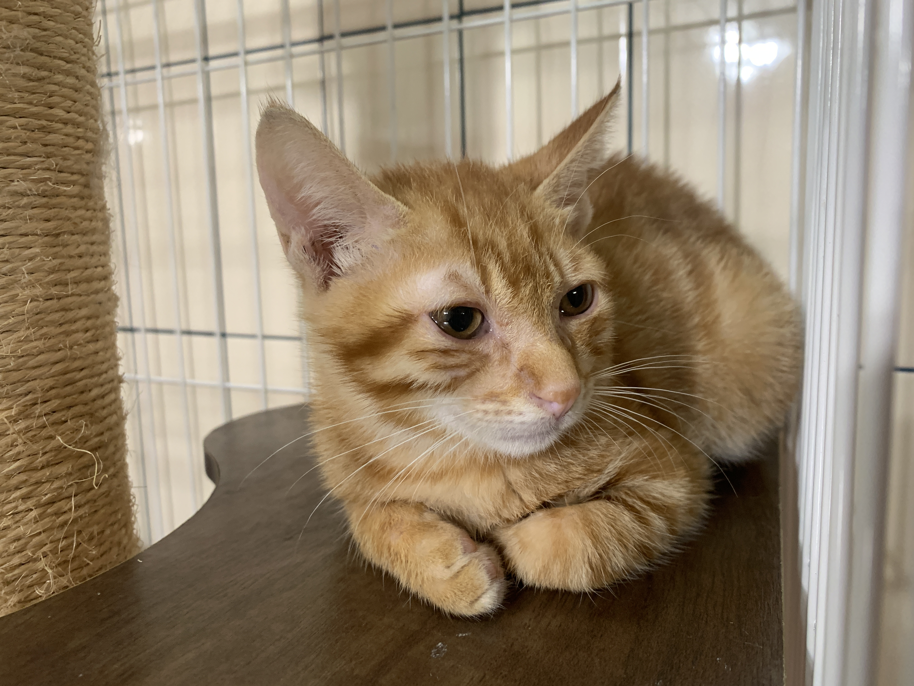

今天初的時候，不知道腦袋那邊不對勁，新年新希望都還沒有想好，就突然弄了一隻貓回來

這邊就簡單分享一下要怎麼去弄到一隻貓

<!--truncate-->

起初是在 Facebook 上的各種貓咪領養社團裡面尋找 

不過跟愛媽溝通幾次後，我就知道這條路看來是行不通的

簽約、家訪、填表單、身家調查...

找工作都沒這麼累XD

不過這是愛媽愛心的展現，只是跟我八字不合而已，也沒什麼好討論的

不想在社團找之後，我就改成去收容所看看，然後無意間發現動物醫院也會跟收容所合作

然後大概都是生病的幼貓居多

貓感覺還是從小開始教育比較簡單，所以最後就去一間動物醫院領養了這隻好像三個月大的小橘

說是領養也不太對，醫生還是要我花 1300 買了一包飼料跟一包貓砂

相當於買飼料送橘貓的概念

養了這隻貓之後，到現在還不到一週 （1/12到家）

感覺人生好像多了什麼又好像沒什麼改變

到目前為止的心得，大概就是貓砂真的好臭啊XD

最後附上我的貓貓圖：

他很可愛 他叫做憨吉 英文名字叫做 Hanji 

目前體重 1.4kg 年齡3個月 很愛叫 目前市場價 1300NT

看起來淚眼汪汪的是因為眼睛發炎 背後沒有什麼令人動容的故事

